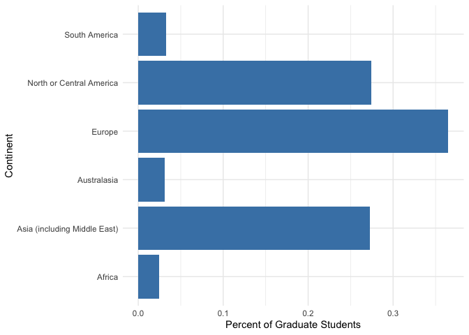
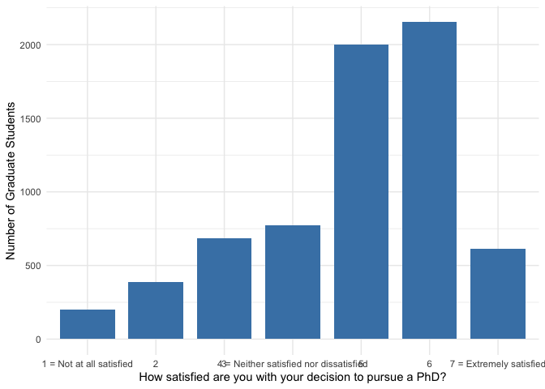
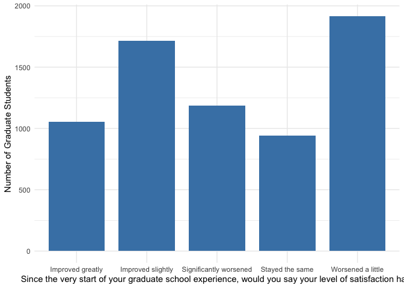
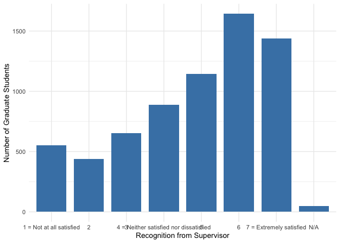

## Introduction

For the past five years, the iconic science journal Nature has launched a survey for PhD students in STEM fields to share their experience in graduate school, hoping to illuminate the goals, challenges, and sources of satisfaction for doctoral students across seven continents. Last year's survey collected data from over 6000 graduate students, which constitutes the highest response rate in the survey's history. The [full data](https://figshare.com/s/74a5ea79d76ad66a8af8) from the survey was made publicly available following publication of an [article](https://www.nature.com/articles/d41586-019-03459-7) discussing the results. It is interesting to note that the survey was offered in English, Spanish, Chinese, French, and Portuguese - open-form questions have not been translated to English if answered by the participant in another language. Available materials include anonymysed raw data, the questionnaire that was provided to PhD students, and a presentation of the survey data. 


## Data description

According to the script with survey information that was provided, there were a total of 65 questions. Not all questions were mandatory, and there was a mix of single choice (yes/no), multiple choice (several options) and free-form questions. 

In the dataset, each row represents an individual who participated in the survey, whereas each row represents a question. We have noticed some redundancy in the dataset column that will require substantial cleanup of the data as part of our next project milestone. For instance, Q12 ("What prompted you to study outside your country of upbringing?") was presented in the survey as a multiple choice question with 11 possible answers (a-k), with the last one (k) being open-form ("If other, please specify"). In the data frame, 11 rows correspond to Q12, each one composed of 2 values: NA, and 1/11 possible answers. As such, the column named Q12_1 only contains NA values and answer "(a) To study at a specific university"; whereas Q12_2 only contains NA values and answer "(b) Lack of funding opportunities in my home country", and so on. We plan on combining columns Q12_1:Q12_11 into a single Q12 column using dplyr::coalesce(), following the same rationale for other redundant columns in the dataset. In addition, open-form questions such as (k) in this specific example will be dropped due to the difficulty in analyzing this, and the fact that they contain answers in different languages.


```r
survey_data <- readxl::read_xlsx(here::here("docs", "Nature_PhD_Survey.xlsx"))
dim(survey_data)
```

```
## [1] 6813  274
```

Due to this redundancy, the dimensions of the raw dataset when downloaded are 6812 rows (participants) by 274 columns (questions), whereas the actual survey only has 63 questions. Below is the complete list of questions, which is a simplified version of the Word document provided [here](https://figshare.com/s/74a5ea79d76ad66a8af8), which includes all the possible answers for each question. For simplicity, we have only included the question, its type, and the category it belongs to within the survey.


```
## [1] 63  4
```

<table class="table table-condensed" style="width: auto !important; margin-left: auto; margin-right: auto;">
 <thead>
  <tr>
   <th style="text-align:left;position: sticky; top:0; background-color: #FFFFFF;"> Question_No </th>
   <th style="text-align:left;position: sticky; top:0; background-color: #FFFFFF;"> Section </th>
   <th style="text-align:left;position: sticky; top:0; background-color: #FFFFFF;"> Question </th>
   <th style="text-align:left;position: sticky; top:0; background-color: #FFFFFF;"> Type </th>
  </tr>
 </thead>
<tbody>
  <tr>
   <td style="text-align:left;"> 1 </td>
   <td style="text-align:left;"> Questionnaire </td>
   <td style="text-align:left;"> Which, if any, of the following degrees are you currently studying for? </td>
   <td style="text-align:left;"> Single choice </td>
  </tr>
  <tr>
   <td style="text-align:left;"> 2 </td>
   <td style="text-align:left;"> Questionnaire </td>
   <td style="text-align:left;"> Which was the most important reason you decided to enrol in a PhD programme? </td>
   <td style="text-align:left;"> Single choice </td>
  </tr>
  <tr>
   <td style="text-align:left;"> 3 </td>
   <td style="text-align:left;"> Questionnaire </td>
   <td style="text-align:left;"> Are you studying in the country you grew up in? </td>
   <td style="text-align:left;"> Single choice </td>
  </tr>
  <tr>
   <td style="text-align:left;"> 4 </td>
   <td style="text-align:left;"> Questionnaire </td>
   <td style="text-align:left;"> Where do you currently live? </td>
   <td style="text-align:left;"> Single choice </td>
  </tr>
  <tr>
   <td style="text-align:left;"> 5 </td>
   <td style="text-align:left;"> Questionnaire </td>
   <td style="text-align:left;"> Which country in Asia? </td>
   <td style="text-align:left;"> Single choice </td>
  </tr>
  <tr>
   <td style="text-align:left;"> 6 </td>
   <td style="text-align:left;"> Questionnaire </td>
   <td style="text-align:left;"> Which country in Australasia? </td>
   <td style="text-align:left;"> Single choice </td>
  </tr>
  <tr>
   <td style="text-align:left;"> 7 </td>
   <td style="text-align:left;"> Questionnaire </td>
   <td style="text-align:left;"> Which country in Africa? </td>
   <td style="text-align:left;"> Single choice </td>
  </tr>
  <tr>
   <td style="text-align:left;"> 8 </td>
   <td style="text-align:left;"> Questionnaire </td>
   <td style="text-align:left;"> Which country in Europe? </td>
   <td style="text-align:left;"> Single choice </td>
  </tr>
  <tr>
   <td style="text-align:left;"> 9 </td>
   <td style="text-align:left;"> Questionnaire </td>
   <td style="text-align:left;"> Which country in North or Central America? </td>
   <td style="text-align:left;"> Single choice </td>
  </tr>
  <tr>
   <td style="text-align:left;"> 10 </td>
   <td style="text-align:left;"> Questionnaire </td>
   <td style="text-align:left;"> Which country in South America? </td>
   <td style="text-align:left;"> Single choice </td>
  </tr>
  <tr>
   <td style="text-align:left;"> 11 </td>
   <td style="text-align:left;"> Questionnaire </td>
   <td style="text-align:left;"> What prompted you to study outside your country of upbringing? </td>
   <td style="text-align:left;"> Multiple choice </td>
  </tr>
  <tr>
   <td style="text-align:left;"> 12 </td>
   <td style="text-align:left;"> Questionnaire </td>
   <td style="text-align:left;"> Do you have a job alongside your studies? </td>
   <td style="text-align:left;"> Single choice </td>
  </tr>
  <tr>
   <td style="text-align:left;"> 13 </td>
   <td style="text-align:left;"> Questionnaire </td>
   <td style="text-align:left;"> What is your main reason for having a job? </td>
   <td style="text-align:left;"> Single choice </td>
  </tr>
  <tr>
   <td style="text-align:left;"> 14 </td>
   <td style="text-align:left;"> PhD Highs and Lows </td>
   <td style="text-align:left;"> What concerns you the most since you started your PhD? </td>
   <td style="text-align:left;"> Multiple choice </td>
  </tr>
  <tr>
   <td style="text-align:left;"> 14a </td>
   <td style="text-align:left;"> PhD Highs and Lows </td>
   <td style="text-align:left;"> Is there anything else not mentioned that has concerned you since you started your PhD? </td>
   <td style="text-align:left;"> Open </td>
  </tr>
  <tr>
   <td style="text-align:left;"> 15 </td>
   <td style="text-align:left;"> PhD Highs and Lows </td>
   <td style="text-align:left;"> Overall, what do you enjoy most about life as a PhD student? </td>
   <td style="text-align:left;"> Single choice </td>
  </tr>
  <tr>
   <td style="text-align:left;"> 16 </td>
   <td style="text-align:left;"> PhD Highs and Lows </td>
   <td style="text-align:left;"> How satisfied are you with your decision to pursue a PhD? </td>
   <td style="text-align:left;"> Scale </td>
  </tr>
  <tr>
   <td style="text-align:left;"> 17 </td>
   <td style="text-align:left;"> Satisfaction with your PhD experience </td>
   <td style="text-align:left;"> How satisfied are you with your PhD experience? </td>
   <td style="text-align:left;"> Scale </td>
  </tr>
  <tr>
   <td style="text-align:left;"> 18 </td>
   <td style="text-align:left;"> Satisfaction with your PhD experience </td>
   <td style="text-align:left;"> Since the very start of your graduate school experience, would you say your level of satisfaction has: </td>
   <td style="text-align:left;"> Single choice </td>
  </tr>
  <tr>
   <td style="text-align:left;"> 19 </td>
   <td style="text-align:left;"> Satisfaction with your PhD experience </td>
   <td style="text-align:left;"> How satisfied are you with each of the following attributes or aspects of your PhD? </td>
   <td style="text-align:left;"> Scale </td>
  </tr>
  <tr>
   <td style="text-align:left;"> 20 </td>
   <td style="text-align:left;"> Satisfaction with your PhD experience </td>
   <td style="text-align:left;"> To what extent does your PhD programme compare to your original expectations? </td>
   <td style="text-align:left;"> Single choice </td>
  </tr>
  <tr>
   <td style="text-align:left;"> 21 </td>
   <td style="text-align:left;"> Your programme </td>
   <td style="text-align:left;"> On average, how many hours a week do you typically spend on your PhD programme? </td>
   <td style="text-align:left;"> Single choice </td>
  </tr>
  <tr>
   <td style="text-align:left;"> 22 </td>
   <td style="text-align:left;"> Your programme </td>
   <td style="text-align:left;"> On average, how much one-on-one contact time do you spend with your supervisor each week? </td>
   <td style="text-align:left;"> Single choice </td>
  </tr>
  <tr>
   <td style="text-align:left;"> 23 </td>
   <td style="text-align:left;"> Your programme </td>
   <td style="text-align:left;"> Overall, how would you describe the academic system, based on your PhD experience so far? </td>
   <td style="text-align:left;"> Open </td>
  </tr>
  <tr>
   <td style="text-align:left;"> 24 </td>
   <td style="text-align:left;"> Your programme </td>
   <td style="text-align:left;"> To what extent do you agree or disagree with the following statements regarding other faculty members or scientists in your department? </td>
   <td style="text-align:left;"> Scale </td>
  </tr>
  <tr>
   <td style="text-align:left;"> 25 </td>
   <td style="text-align:left;"> Your programme </td>
   <td style="text-align:left;"> Have you ever sought help for anxiety or depression caused by PhD study? </td>
   <td style="text-align:left;"> Single choice </td>
  </tr>
  <tr>
   <td style="text-align:left;"> 26 </td>
   <td style="text-align:left;"> Your programme </td>
   <td style="text-align:left;"> Did you seek help for anxiety or depression within your institution? </td>
   <td style="text-align:left;"> Single choice </td>
  </tr>
  <tr>
   <td style="text-align:left;"> 27 </td>
   <td style="text-align:left;"> Your programme </td>
   <td style="text-align:left;"> To what extent do you agree or disagree with the following statements? </td>
   <td style="text-align:left;"> Scale </td>
  </tr>
  <tr>
   <td style="text-align:left;"> 28 </td>
   <td style="text-align:left;"> Mental health and discrimination </td>
   <td style="text-align:left;"> Do you feel that you have experienced bullying in your PhD program? </td>
   <td style="text-align:left;"> Single choice </td>
  </tr>
  <tr>
   <td style="text-align:left;"> 29 </td>
   <td style="text-align:left;"> Mental health and discrimination </td>
   <td style="text-align:left;"> Who was the perpetrator(s)? </td>
   <td style="text-align:left;"> Multiple choice </td>
  </tr>
  <tr>
   <td style="text-align:left;"> 29a </td>
   <td style="text-align:left;"> Mental health and discrimination </td>
   <td style="text-align:left;"> Do you feel able to speak out about your experiences of bullying without personal repercussions? </td>
   <td style="text-align:left;"> Single choice </td>
  </tr>
  <tr>
   <td style="text-align:left;"> 30 </td>
   <td style="text-align:left;"> Mental health and discrimination </td>
   <td style="text-align:left;"> Do you feel that you have experienceddiscrimination or harassment in your PhD program? </td>
   <td style="text-align:left;"> Single choice </td>
  </tr>
  <tr>
   <td style="text-align:left;"> 31 </td>
   <td style="text-align:left;"> Mental health and discrimination </td>
   <td style="text-align:left;"> Which of the following have you experienced? </td>
   <td style="text-align:left;"> Multiple choice </td>
  </tr>
  <tr>
   <td style="text-align:left;"> 32 </td>
   <td style="text-align:left;"> Future career plans </td>
   <td style="text-align:left;"> How much do you expect your PhD to improve your job prospects? </td>
   <td style="text-align:left;"> Scale </td>
  </tr>
  <tr>
   <td style="text-align:left;"> 33 </td>
   <td style="text-align:left;"> Future career plans </td>
   <td style="text-align:left;"> Which of the following sectors would you most like to work in (beyond a postdoc) when you complete your degree? </td>
   <td style="text-align:left;"> Multiple choice and ranking </td>
  </tr>
  <tr>
   <td style="text-align:left;"> 34 </td>
   <td style="text-align:left;"> Future career plans </td>
   <td style="text-align:left;"> Please use the scale below to indicate how likely you are to pursue one of these career paths upon completion of your programme. </td>
   <td style="text-align:left;"> Scale </td>
  </tr>
  <tr>
   <td style="text-align:left;"> 35 </td>
   <td style="text-align:left;"> Future career plans </td>
   <td style="text-align:left;"> If you’re unlikely to pursue an academic research career, what are the main reasons? </td>
   <td style="text-align:left;"> Multiple choice </td>
  </tr>
  <tr>
   <td style="text-align:left;"> 36 </td>
   <td style="text-align:left;"> Future career plans </td>
   <td style="text-align:left;"> What position do you most expect to occupy immediately after you complete your degree? </td>
   <td style="text-align:left;"> Single choice </td>
  </tr>
  <tr>
   <td style="text-align:left;"> 37 </td>
   <td style="text-align:left;"> Future career plans </td>
   <td style="text-align:left;"> What type of career you are interested in pursuing after your graduate degree? </td>
   <td style="text-align:left;"> Open </td>
  </tr>
  <tr>
   <td style="text-align:left;"> 38 </td>
   <td style="text-align:left;"> Career expectations </td>
   <td style="text-align:left;"> After completing your PhD, how long do you think it will take you to find a permanent (non-trainee) position? </td>
   <td style="text-align:left;"> Single choice </td>
  </tr>
  <tr>
   <td style="text-align:left;"> 39 </td>
   <td style="text-align:left;"> Career expectations </td>
   <td style="text-align:left;"> How much more likely are you now to pursue a research career than when you launched your PhD programme? </td>
   <td style="text-align:left;"> Single choice </td>
  </tr>
  <tr>
   <td style="text-align:left;"> 40 </td>
   <td style="text-align:left;"> Career expectations </td>
   <td style="text-align:left;"> What is the main reason why you are more likely to pursue a research career? </td>
   <td style="text-align:left;"> Single choice </td>
  </tr>
  <tr>
   <td style="text-align:left;"> 41 </td>
   <td style="text-align:left;"> Career expectations </td>
   <td style="text-align:left;"> How did you arrive at your current career decision? </td>
   <td style="text-align:left;"> Multiple choice </td>
  </tr>
  <tr>
   <td style="text-align:left;"> 42 </td>
   <td style="text-align:left;"> Career support </td>
   <td style="text-align:left;"> How do you learn about available career opportunities that are beyond academia? </td>
   <td style="text-align:left;"> Multiple choice </td>
  </tr>
  <tr>
   <td style="text-align:left;"> 43 </td>
   <td style="text-align:left;"> Career support </td>
   <td style="text-align:left;"> Which of the following 3 things would you say are the most difficult for PhD students in your discipline? </td>
   <td style="text-align:left;"> Multiple choice </td>
  </tr>
  <tr>
   <td style="text-align:left;"> 44 </td>
   <td style="text-align:left;"> Career support </td>
   <td style="text-align:left;"> Which of the following would you say are the most difficult for PhD students in the country where you are studying? </td>
   <td style="text-align:left;"> Multiple choice </td>
  </tr>
  <tr>
   <td style="text-align:left;"> 45 </td>
   <td style="text-align:left;"> Career support </td>
   <td style="text-align:left;"> Which of the following resources do you think PhD students need the most in order to establish a satisfying career? </td>
   <td style="text-align:left;"> Multiple choice </td>
  </tr>
  <tr>
   <td style="text-align:left;"> 46 </td>
   <td style="text-align:left;"> Career support </td>
   <td style="text-align:left;"> How well is your programme preparing you to carry out each of the following activities? </td>
   <td style="text-align:left;"> Scale </td>
  </tr>
  <tr>
   <td style="text-align:left;"> 47 </td>
   <td style="text-align:left;"> Career support </td>
   <td style="text-align:left;"> To what extent do you agree or disagree with the following statements? </td>
   <td style="text-align:left;"> Scale </td>
  </tr>
  <tr>
   <td style="text-align:left;"> 48 </td>
   <td style="text-align:left;"> Career support </td>
   <td style="text-align:left;"> Which, if any, of the following activities have you done to advance your career? </td>
   <td style="text-align:left;"> Multiple choice </td>
  </tr>
  <tr>
   <td style="text-align:left;"> 49 </td>
   <td style="text-align:left;"> Career support </td>
   <td style="text-align:left;"> Which of the following social media networks have you used to build your professional network? </td>
   <td style="text-align:left;"> Multiple choice </td>
  </tr>
  <tr>
   <td style="text-align:left;"> 50 </td>
   <td style="text-align:left;"> Reflection </td>
   <td style="text-align:left;"> What would you do differently right now if you were starting your programme? </td>
   <td style="text-align:left;"> Multiple choice </td>
  </tr>
  <tr>
   <td style="text-align:left;"> 51 </td>
   <td style="text-align:left;"> Reflection </td>
   <td style="text-align:left;"> With the benefit of hindsight, what one thing do you know now which you wish you’d known about when you started your PhD? </td>
   <td style="text-align:left;"> Open </td>
  </tr>
  <tr>
   <td style="text-align:left;"> 52 </td>
   <td style="text-align:left;"> Reflection </td>
   <td style="text-align:left;"> What is your age? </td>
   <td style="text-align:left;"> Single choice </td>
  </tr>
  <tr>
   <td style="text-align:left;"> 53 </td>
   <td style="text-align:left;"> Reflection </td>
   <td style="text-align:left;"> Are you… (Gender) </td>
   <td style="text-align:left;"> Single choice </td>
  </tr>
  <tr>
   <td style="text-align:left;"> 54 </td>
   <td style="text-align:left;"> Reflection </td>
   <td style="text-align:left;"> Which of the following best describes you? (Ethnicity) </td>
   <td style="text-align:left;"> Multiple choice </td>
  </tr>
  <tr>
   <td style="text-align:left;"> 55 </td>
   <td style="text-align:left;"> Reflection </td>
   <td style="text-align:left;"> Do you have any caring responsibilities? </td>
   <td style="text-align:left;"> Multiple choice </td>
  </tr>
  <tr>
   <td style="text-align:left;"> 56 </td>
   <td style="text-align:left;"> Reflection </td>
   <td style="text-align:left;"> Thank you for taking part in the survey. Are there any more comments you’d like to share with us? </td>
   <td style="text-align:left;"> Open </td>
  </tr>
  <tr>
   <td style="text-align:left;"> 57 </td>
   <td style="text-align:left;"> Thank you </td>
   <td style="text-align:left;"> Would you like to be entered into a prize draw for a chance to win GBP £250? You can find prize draw terms and conditions here. Shift Learning will be administering the incentive and a winner will be contacted within 4 weeks of the survey closing date. </td>
   <td style="text-align:left;"> Single choice </td>
  </tr>
  <tr>
   <td style="text-align:left;"> 58 </td>
   <td style="text-align:left;"> Thank you </td>
   <td style="text-align:left;"> Nature may want to contact you again to ask for more information on the subjects discussed in this survey, or to ask you specific questions about your comments and answers. Are you happy to receive follow up requests? </td>
   <td style="text-align:left;"> Single choice </td>
  </tr>
  <tr>
   <td style="text-align:left;"> 59 </td>
   <td style="text-align:left;"> Thank you </td>
   <td style="text-align:left;"> Springer Nature is keen to update PhD students with advice and information about their programme and career options via a regular newsletter. Would you like to be kept informed about this planned service from Nature Careers? </td>
   <td style="text-align:left;"> Single choice </td>
  </tr>
  <tr>
   <td style="text-align:left;"> 60 </td>
   <td style="text-align:left;"> Thank you </td>
   <td style="text-align:left;"> Shift Learning carry out paid research in the education sector throughout the year. Would you be happy to be contacted about relevant future research opportunities? </td>
   <td style="text-align:left;"> Single choice </td>
  </tr>
  <tr>
   <td style="text-align:left;"> 61 </td>
   <td style="text-align:left;"> Thank you </td>
   <td style="text-align:left;"> Please fill in your contact details below. </td>
   <td style="text-align:left;"> Open </td>
  </tr>
</tbody>
</table>

## Exploring the dataset

First let's take a look at some basic demographic information about the survey participants

<!-- -->
And just to view this as a percentage of our data frame...


```r
ggplot(survey_data2, aes(Q5)) +  
  geom_bar(aes(y = (..count..)/sum(..count..)), fill = "steelblue") +
  coord_flip() +
  xlab("Continent") +
  ylab("Percent of Graduate Students") +
  theme_minimal()
```

<!-- -->

It would appear that most of the participants in this survey are from Europe, the Americas, or Asia. This is not very surprising, but is good to verify the sample is relatively representative of the distribution of higher education institutes around the world.


Next, I'm curious to see how many people are studying outside their country of birth...

<!-- -->

```
## NULL
```

We have been particularly interested in what this survey can tell us about grad school satisfaction and mental health throughout grad school. Let's take a look at some of this data...

<!-- --><!-- --><!-- --><!-- --><!-- --><!-- -->

## Plan of Action

It would appear that, from sampling a few survey items, that people aren't necessarily thinking negatively about their PhD experience. Some of these items show variability curves that are relatively bell shaped, while others are a little more variable.

We would have liked to run more in depth initial analysis, such as looking at correlations between items in the survey. However, the data needs extensive cleaning and organizing first. For instance, many of the cell values are taken not as numeric but as characters, making it difficult to run correlations at this stage. We are aware the next milestone project is more oriented towards data wrangling, and we would like to expand with more sophisticated analysis when we have a cleaner data set.

In the meantime, it can still be meaningful to examine individual items and their distribution of results in this manor.

Future analysis will be focused on sastisfaction with PhD experience compared to mental health outcomes and personality traits.


## References 


